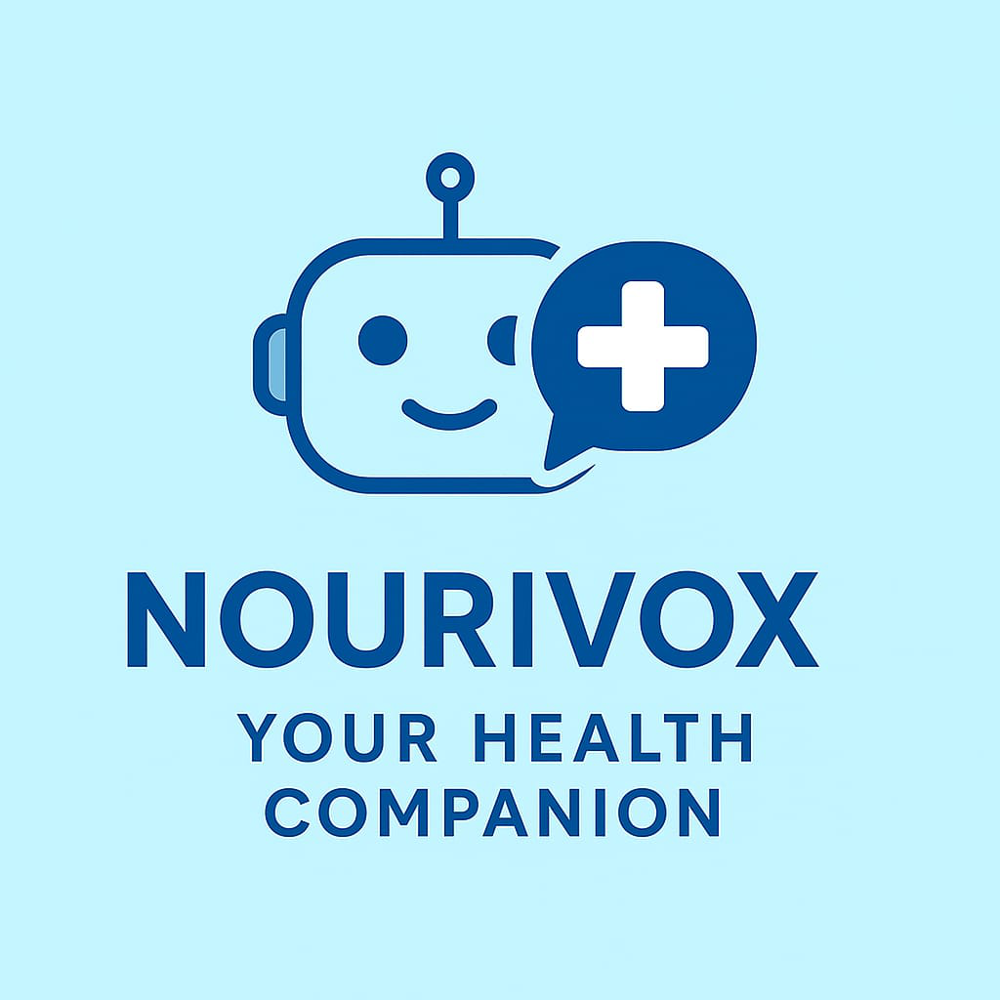

# Nourivox Healthcare Assistant



Nourivox is an AI-powered healthcare assistant designed to provide patients, doctors, and admins with seamless interaction. Users can chat with an AI assistant for general health advice, book appointments, get reminders, and connect with healthcare professionals. It also supports voice input and image uploads for disease identification.

---

## Features

- **User Roles:** Patient, Doctor, Admin with separate registration forms.
- **Authentication:** Email/password and Google OAuth via Supabase.
- **AI Chatbot:** 
  - Provides healthcare guidance.
  - Books appointments.
  - Shows reminders.
  - Connects to doctors.
- **Voice Input:** (Feature coming soon)
- **File Upload:** Upload images of symptoms for AI reference.
- **Responsive Design:** Works on desktop and mobile.
- **Pharmacy Section:** View multiple pharmacy centers (e.g., Taskar Centre).

---

## Tech Stack

- **Frontend:** React, TypeScript, TailwindCSS
- **Authentication & Backend:** Supabase
- **Icons & UI:** lucide-react, shadcn/ui
- **Routing:** react-router-dom

---
## Project Structure
```bash
nourivox-healthcare/
├─ public/ # Public assets like favicon, index.html
├─ src/
│ ├─ assets/ # Images and logos
│ │ ├─ nourivox-logo.png
│ │ └─ pharmacy-taskar.png # Example pharmacy center image
│ ├─ components/ # Reusable UI components
│ │ ├─ ChatBot.jsx
│ │ └─ QuickActions.jsx
│ ├─ contexts/ # Authentication context
│ │ └─ AuthContext.jsx
│ ├─ hooks/ # Custom hooks
│ │ └─ use-toast.ts
│ ├─ integrations/ # Supabase client setup
│ │ └─ supabase/client.js
│ ├─ pages/ # Page components
│ │ ├─ Login.jsx
│ │ ├─ Signup.jsx
│ │ └─ Dashboard.jsx
│ ├─ App.jsx # Main React app component
│ └─ main.jsx # Entry point for React
├─ .gitignore # Ignore node_modules, env files
├─ package.json
├─ tailwind.config.js
├─ vite.config.js # Vite configuration
└─ README.md
```

---

## Installation

1. Clone the repository:
```bash
git clone <your-repo-url>
```
## Navigate to the project folder:
cd doc-ai-guide


## Project Structure

